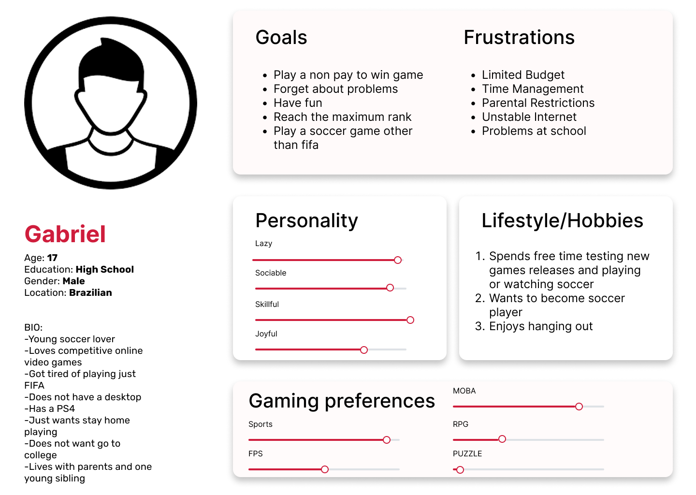
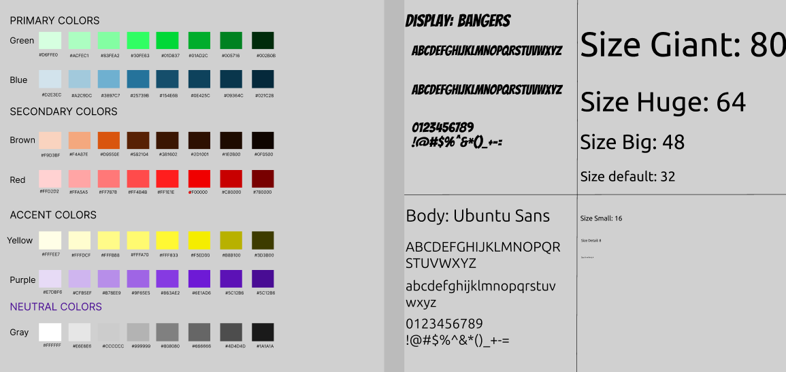
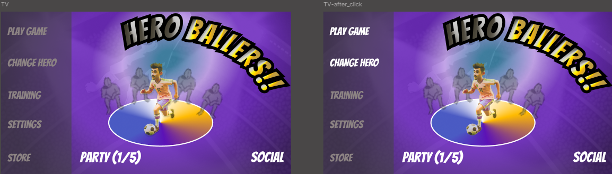
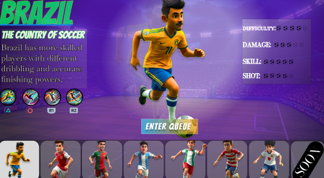
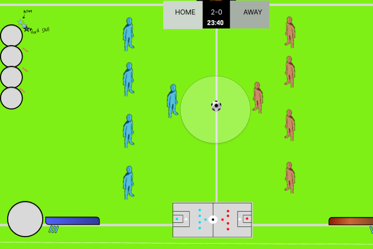
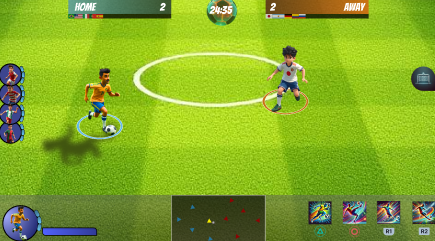

# Hero Ballers – UI/UX Design Documentation

This repository contains UI/UX and game design documentation for the *Hero Ballers* project.  
The focus of this work is interface design, user flow, and visual consistency for a competitive game experience.

## Overview
This project explores the design process behind key game interfaces, including menu navigation, champion selection flow, and a structured design system. All screens and wireframes were designed and organized using Figma, with an emphasis on clarity, usability, and scalability.

## UI Screenshots

### Persona

### Design System Soecs

### Main Menu

### Champion Select

### UI Wireframe/UI Mid-Fi

## Tools
- Figma

## AI-Generated Assets
Some player characters and visual references used in this project were generated with the assistance of AI tools. These assets were used strictly for prototyping, visual exploration, and educational purposes.

## Project Purpose 
No source code is included, as the focus of this project is design documentation rather than implementation.

## Links
- Figma Design:  
https://www.figma.com/design/IHSt9rJIyiZhiuNs5JiMIr/HeroBallers_Trial_Display?node-id=87-2&p=f&t=uM7zlSGMB6D4cvos-0

